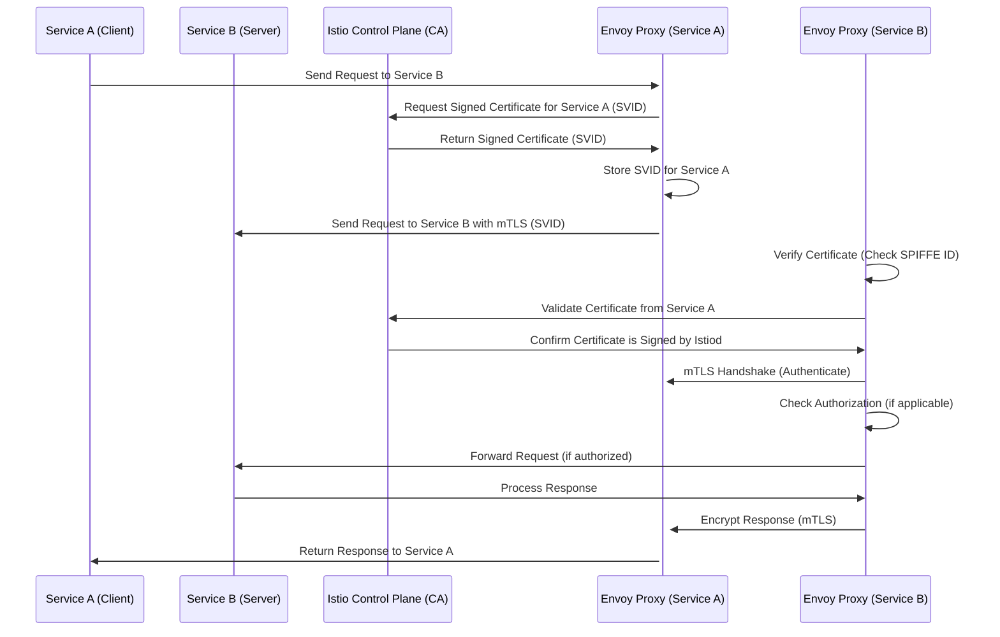

### SPIFFE (Secure Production Identity Framework for Everyone)

SPIFFE is a universal identity system for software services. Instead of 
using passwords or IP addresses to identify services, SPIFFE gives each 
service a cryptographic identity (like a digital passport).

**Problem it solves**: In dynamic cloud environments, services move 
between machines, so IP-based security breaks. SPIFFE provides portable 
identity.

**How it works**: Each service gets an SVID (SPIFFE Verifiable Identity 
Document) - a short-lived certificate with a unique ID like 
`spiffe://cluster.local/ns/default/sa/payment-service`.

**Why Istio uses it**: Enables automatic mTLS between services without 
manual certificate management.

Below is the Mermaid sequence diagram that illustrates the workflow for SPIFFE identity management and mTLS communication within a service mesh (like Istio). This diagram shows the behavior of how Istio issues and verifies certificates, enabling secure communication between services.

### Explanation of the Diagram:

1. Service A sends a request to Service B.
2. The Envoy proxy of Service A requests a signed certificate (SVID) from Istiod (the Istio control plane), which acts as the Certificate Authority (CA).
3. Istiod responds with a signed certificate containing the SPIFFE ID for Service A.
4. Service A's Envoy proxy sends the request to Service B's Envoy proxy using mTLS.
5. Service B's Envoy proxy validates the certificate sent by Service A's Envoy proxy against Istiod.
6. If the certificate is valid, Envoy proxies perform the mTLS handshake, ensuring both services authenticate each other.
7. Optionally, authorization policies can be checked, and the request is forwarded to Service B if authorized.
8. Service B processes the request and sends the response back through Envoy proxies, which encrypt the response with mTLS.
9. Finally, the response is returned to Service A.

### Key Concepts:

- SVID (SPIFFE Verifiable Identity Document) is used to uniquely identify services in a platform-agnostic, cryptographic way.
- mTLS ensures that communication between services is secure and trusted, with mutual authentication based on the certificates (SVIDs).
- Istiod acts as the Certificate Authority (CA) in Istio, issuing certificates and ensuring trust between services.